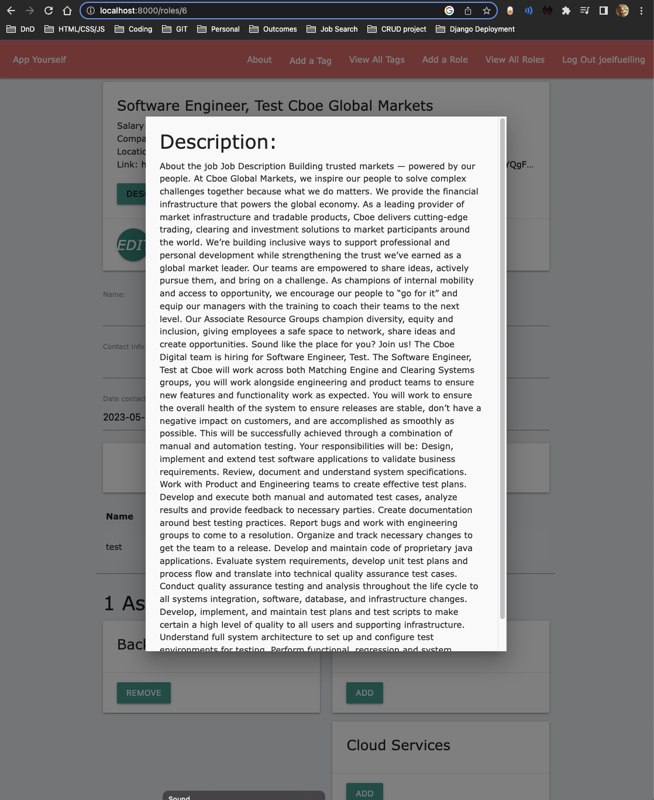
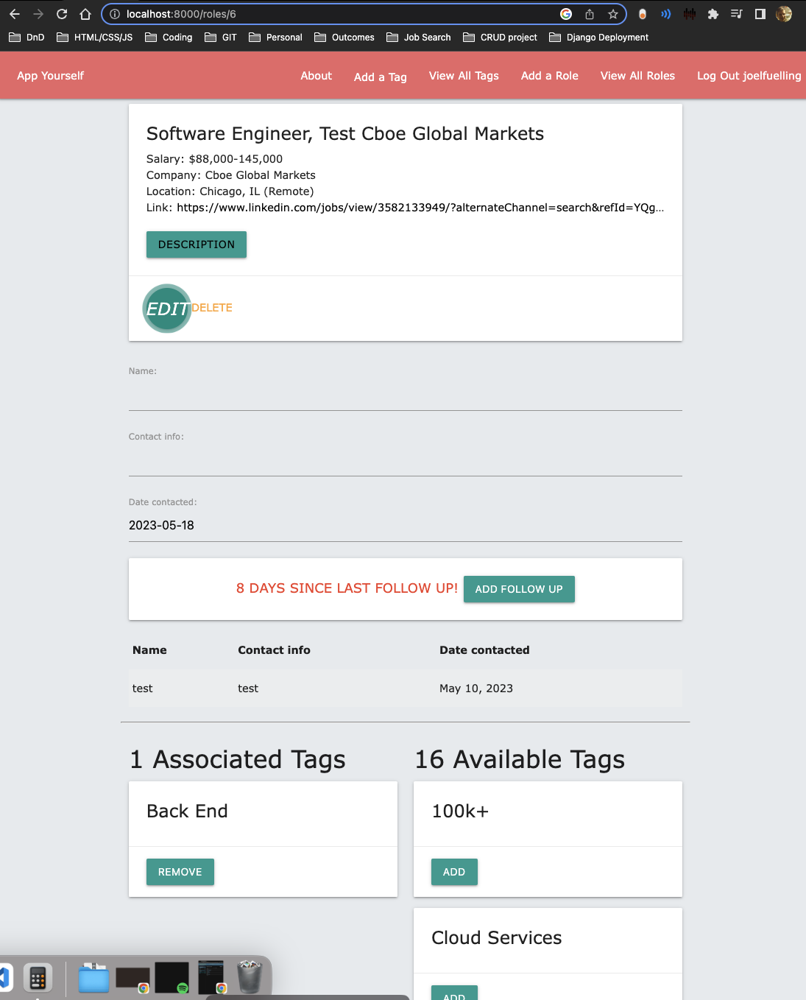

*App Yourself*
App Yourself is Userbased app to add/edit/delete roles applied to or interested in! Add a record for each followup on each role (contact, date/time) and be alerted via text of the number of days elapsed since your last follow up. 

You'll be able to create and add tags to those jobs to categorize what attributes each job has.

User can enter a link to the role or website, or whichever pertinent link they choose to associate with the role. That link can be accessed on the individiual role.

Create and add/remove tags to roles to categorize industry, work, languages used, etc.

Screenshot

*Technologies Used*
Python
Django
HTML
CSS
JavaScript
Heroku Deployment platform
CSS/Materialize

*Getting Started*
https://appyourself.herokuapp.com/
https://trello.com/b/vPLn9Rb6/app-yourself

